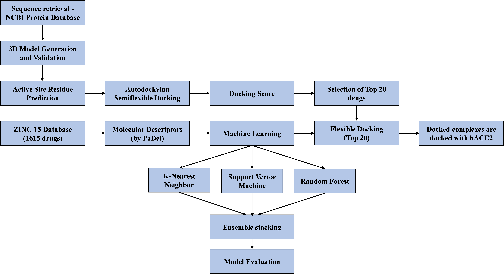

# Project-delta
Machine Learning based prediction for effective drug binding to SARS-COV2 Delta strain Spike protein

# Overview
The present work employs a combination of machine learning and rigorous docking experiments to evaluate the prediction performances of various algorithms based on calculated molecular descriptors. The correlation between 15 most useful features (descriptors) and identify a clear pattern that can efficiently define effective drug-protein binding is also calculated. With the statistical analysis, we report close observation of these 15 molecular properties while considering virtual screening or lead generation for SARS-Cov-2 spike protein.

## Data Collection:
All the data supporting the ligand library used in this study is available in the ZINC15 database at https://zinc15.docking.org/substances/subsets/fda/. The data regarding hydroxychloroquine and remdesivir used for docking are openly available on DrugBank database at https://go.drugbank.com/drugs/DB01611, accession number DB01611 and https://go.drugbank.com/drugs/DB14761, accession number DB14761 respectively.

## Project work-flow:

## Requirements:

Platform: 
  * Ubuntu 20.04
  * Windows 10

Requirements: 
  * Python 3.8.8 (3.5+ should work fine)
  * Pandas
  * Numpy
  * Matplotlib
  * Seaborn
  * Imblearn
  * SelectKBest
  * SlickML (works on Ubuntu)

## Softwares used for Molecular Descriptor Calculation and Dataset curation:
  * Autodock Suit (1.5.6)
  * PyMol (Version 2.0)
  * Discovery Studio (v21.1.0.20298)
